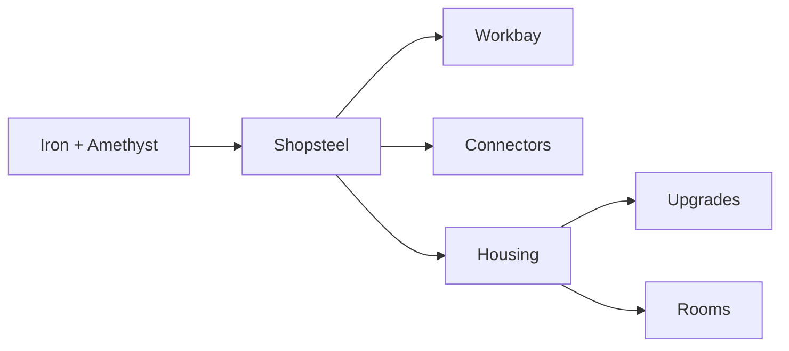

Every item Workbay adds, what it is for, and how you get one. Two items hold the whole tree
together: **Shopsteel**, the metal everything is made of, and the **Housing**, the frame every
upgrade and every Room is built on. Once you have those two, the rest of the mod is one pattern
with a different item in the middle.

Every slot in a recipe below is a link. Hover it for what the item is and where it comes from;
click it for its page - the [Minecraft Wiki](https://minecraft.wiki) for vanilla items, this page
for ours. In game it is the ingredient in your inventory that puts a recipe in your **recipe
book**: iron and amethyst unlock Shopsteel, Shopsteel unlocks the Workbay, the Connector and the
Housing, and a Housing unlocks the four upgrades and the three Rooms. JEI and EMI list everything
from the start. Shift on any item shows the same description in its tooltip.

| | Item | In one line |
| :-: | --- | --- |
|  | [Workbay](#workbay) | The block. Hosts machines out of sight. |
|  | [Shopsteel](#shopsteel) | The metal everything here is built from. |
|  | [Connector](#connector) | Links a bay to a chest, tank or machine out in the world. |
|  | [Housing](#housing) | The frame under every upgrade and every Room. |
|  | [Expansion Plate](#expansion-plate) | One more bay. |
|  | [Impeller](#impeller) | Doubles what every link moves in a step and halves the wait between steps: four times the throughput, and two may be fitted, for sixteen. |
|  | [Resonator](#resonator) | Links may cross dimensions. |
|  | [Anchor](#anchor) | The network keeps running while you are online and elsewhere. |
|  | [Rooms](#rooms) | A build you can pick up, carry and rack. |

## The order to build in

---

## Workbay

 **Workbay** - the block the mod is named after.

Place it, right-click it, and it opens on four screens: **WORKBAY** (the bays),
**UPGRADES**, **FLOW** (the network drawn as a map) and **NETWORKS** (which network this
block is holding). A machine racked into a bay moves into a private dimension and goes on
ticking exactly as it did on the floor; select its bay and press **Open its screen** and the
machine's own screen opens from where you stand. A host who has turned `remoteScreens` off
in `config/workbay-mixins.properties` gets **Enter bay** instead, which walks you to it.

A fresh Workbay has **two** bays. The network belongs to whoever placed it and is born
locked; see [[Networks and Locking]]. The recipe is cheap on purpose, so the block arrives around
your first furnace rather than at the end of the game.

<table><tr><td valign="middle">  </td><td valign="middle" align="center"> </td><td valign="middle"></td></tr></table>

See also: **[[Getting Started]]**, **[[Machines and Bays]]**.

## Shopsteel

 **Shopsteel** - iron and an amethyst shard. Everything here is built from it.

Shapeless, and it makes two, so one trip to a geode goes a long way. There is no other use
for it: if you have Shopsteel, you are building something on this page.

<table><tr><td valign="middle">  </td><td valign="middle" align="center"> </td><td valign="middle"></td></tr></table>

## Connector

 **Connector** - the plate that replaces your pipes.

Right-click a Workbay while holding one - or a whole stack - to pair it, **then** stick it
on the chest, tank or machine you want reached. Back at the Workbay, press **Add** on a bay,
pick the Connector, and switch the new channel on. Items, fluids, energy and Mekanism
chemicals then move between that block and that bay with a direction, a filter, a rate and a
speed - no cable in between.

A Connector belongs to a **network**, not to a bay: one plate can carry a channel on every
bay at once. An unpaired one still places, does nothing, and says so; right-clicking a
Connector already in the world opens its rename panel rather than pairing it.

One row, anywhere in the grid. Makes four at a time.

<table><tr><td valign="middle">  </td><td valign="middle" align="center"> </td><td valign="middle"></td></tr></table>

See also: **[[Connectors and FLOW]]**.

## Housing

 **Housing** - the gate to the second half of the mod.

It does nothing on its own. Holding one puts every upgrade and Room recipe in your recipe book
(JEI and EMI list them from the start), and every one of those recipes has a Housing at the
bottom of the frame. An Eye of Ender in the middle is the real cost.

<table><tr><td valign="middle">  </td><td valign="middle" align="center"> </td><td valign="middle"></td></tr></table>

---

## Upgrades

All four share one frame - Shopsteel above and to the sides, a Housing underneath, one item
in the middle. They are fitted on the **UPGRADES** screen and consumed when they are.

### Expansion Plate

 One more bay on this rack, up to a ceiling of eight. A Workbay starts with two, so six plates is the whole ladder. A machine lives in a bay, so this is simply how many machines one Workbay holds at once.

<table><tr><td valign="middle">  </td><td valign="middle" align="center"> </td><td valign="middle"></td></tr></table>

> Capped by `maxBaysPerWorkbay` (default 8). See [[Server Configuration]].

### Impeller

 Doubles what every link moves in a step and halves the wait between steps: four times the throughput, and two may be fitted, for sixteen.

<table><tr><td valign="middle">  </td><td valign="middle" align="center"> </td><td valign="middle"></td></tr></table>

> Step size is `impellerStep` (default 2), count is `maxImpellers` (default 2). See [[Server Configuration]].

### Resonator

 Lets the two ends of a link stand in different dimensions - a bay in the Overworld pulling from a tank in the Nether. Without one, a cross-dimension link reads "Needs a Resonator" ("Off-world" in the narrow column).

<table><tr><td valign="middle">  </td><td valign="middle" align="center"> </td><td valign="middle"></td></tr></table>

> A server can switch it off entirely with `allowCrossDimensionLinks = false`. See [[Server Configuration]].

### Anchor

 Keeps the network running with nobody standing there, for as long as you are online anywhere in the world - plus a grace period after you log out. This is the one chunk-loading thing the mod does, and it is the first thing a busy server turns off.

<table><tr><td valign="middle">  </td><td valign="middle" align="center"> </td><td valign="middle"></td></tr></table>

> `allowAnchors`, `maxAnchoredWorkbaysPerPlayer` (default 4) and `anchorGraceMinutes` (default 5) all govern it. See [[Server Configuration]].

### The UPGRADES screen

Each upgrade has a cap, and the screen shows how many you have fitted out of it. All four caps are server options - see [[Server Configuration]].

| Upgrade | Cap | Set by |
| --- | :-: | --- |
| Expansion Plate | 6 | `maxBaysPerWorkbay` minus the two bays every Workbay starts with |
| Impeller | 2 | `maxImpellers` |
| Resonator | 1 | `allowCrossDimensionLinks` switches it off entirely |
| Anchor | 1 | `allowAnchors` switches it off entirely |

---

## Rooms

 A Room is a build you can pick up and carry, and it racks into a bay like a machine.

A Room goes in a bay, never on the ground - right-clicking the world with one is refused.
Rack it into an empty bay and press **Enter** on that bay's panel to step inside.
Everything you build in there travels with the item, so a Room can be handed to another
player, carried across a world, or stored in a bay. Three sizes, same frame, a rarer middle
item each time.

A bay holding a room has no face cube and no channels of its own; a room reaches the network
through Connectors placed inside it, and those travel with it.

| | Room | Inside | Middle item |
| :-: | --- | :-: | --- |
|  | Room | 3 x 3 x 3 |  Diamond |
|  | Wide Room | 9 x 9 x 9 |  Echo Shard |
|  | Vast Room | 13 x 13 x 13 |  Nether Star |

### Room - <em>3 x 3 x 3 inside</em>

<table><tr><td valign="middle">  </td><td valign="middle" align="center"> </td><td valign="middle"></td></tr></table>

### Wide Room - <em>9 x 9 x 9 inside</em>

<table><tr><td valign="middle">  </td><td valign="middle" align="center"> </td><td valign="middle"></td></tr></table>

### Vast Room - <em>13 x 13 x 13 inside</em>

<table><tr><td valign="middle">  </td><td valign="middle" align="center"> </td><td valign="middle"></td></tr></table>

Rooms sleep by default: one runs while somebody is standing in it. A server can change that
with `roomsLoadWithWorkbay`.

See also: **[[Rooms]]**.

---

Next: **[[Machines and Bays]]**, **[[Rooms]]**.
