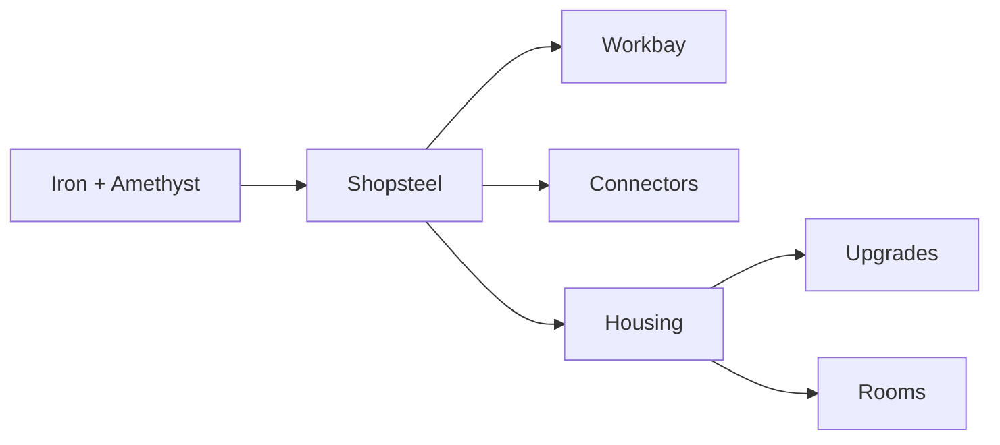

Two items hold the whole tree together: **Shopsteel**, the metal everything is made of, and
the **Housing**, the frame every upgrade and every Room is built on. Once you have those two,
the rest of the mod is one pattern with a different item in the middle.

Every slot below is a link. Hover it for what the item is and where it comes from; click it
for its page - the [Minecraft Wiki](https://minecraft.wiki) for vanilla items, [[Items]] for
ours. In game it is the ingredient in your inventory that puts a recipe in your **recipe
book**: iron and amethyst unlock Shopsteel, Shopsteel unlocks the Workbay, the Connector and
the Housing, and a Housing unlocks the four upgrades and the three Rooms. JEI and EMI list
everything from the start. Shift on any item shows the same description in its tooltip.

## The order to build in

## Step 1 &middot; Shopsteel

<table><tr><td valign="middle">  </td><td valign="middle" align="center"> </td><td valign="middle"></td></tr></table>

Shapeless, so the two ingredients go anywhere in the grid. Makes **2**. Everything below is
built from it.

## Step 2 &middot; The Workbay

<table><tr><td valign="middle">  </td><td valign="middle" align="center"> </td><td valign="middle"></td></tr></table>

Cheap on purpose, so the block arrives around your first furnace rather than at the end of
the game.

## Step 3 &middot; Connectors

<table><tr><td valign="middle">  </td><td valign="middle" align="center"> </td><td valign="middle"></td></tr></table>

One row, anywhere in the grid. Makes **4**. A Connector is the plate you stick on a chest,
tank or machine to link it to a bay - see [[Connectors and FLOW]].

## Step 4 &middot; The Housing

<table><tr><td valign="middle">  </td><td valign="middle" align="center"> </td><td valign="middle"></td></tr></table>

The gate to everything below: no Housing, no upgrades and no Rooms.

## Step 5 &middot; One frame, seven results

Every upgrade and every Room shares the same shape. Shopsteel above and to the sides, a
Housing underneath, and **one item in the middle** that decides what comes out. The
difficulty of that middle item is the price of the upgrade.

### Upgrades

####  Expansion Plate - <em>+1 bay</em>

<table><tr><td valign="middle">  </td><td valign="middle" align="center"> </td><td valign="middle"></td></tr></table>

One more bay on this rack. A machine lives in a bay, so this is how many machines one Workbay can hold at once. Fitted on the UPGRADES tab and used up.

####  Impeller - <em>Faster links</em>

<table><tr><td valign="middle">  </td><td valign="middle" align="center"> </td><td valign="middle"></td></tr></table>

Every link on this Workbay moves twice as much per step and waits half as long between steps. Two of them stack.

####  Resonator - <em>Any dimension</em>

<table><tr><td valign="middle">  </td><td valign="middle" align="center"> </td><td valign="middle"></td></tr></table>

Lets the two ends of a link stand in different dimensions.

####  Anchor - <em>While away</em>

<table><tr><td valign="middle">  </td><td valign="middle" align="center"> </td><td valign="middle"></td></tr></table>

Keeps the network running with nobody standing there.

### Rooms

A Room is a build you can pick up and carry, and it racks into a bay like a machine. Same
frame, a rarer middle item for a bigger interior. See [[Rooms]].

####  Room - <em>3 x 3 x 3 inside</em>

<table><tr><td valign="middle">  </td><td valign="middle" align="center"> </td><td valign="middle"></td></tr></table>

####  Wide Room - <em>9 x 9 x 9 inside</em>

<table><tr><td valign="middle">  </td><td valign="middle" align="center"> </td><td valign="middle"></td></tr></table>

####  Vast Room - <em>13 x 13 x 13 inside</em>

<table><tr><td valign="middle">  </td><td valign="middle" align="center"> </td><td valign="middle"></td></tr></table>

## The UPGRADES screen

Each upgrade has a cap, and the screen shows how many you have fitted out of it.

| Upgrade | Cap | Set by |
| --- | :-: | --- |
|  Expansion Plate | 6 | `maxBaysPerWorkbay` minus the two bays every Workbay starts with |
|  Impeller | 2 | `maxImpellers` |
|  Resonator | 1 | `allowCrossDimensionLinks` switches it off entirely |
|  Anchor | 1 | `allowAnchors` switches it off entirely |

All four are server options - see [[Server Configuration]].

## How many bays do I get?

A Workbay starts with **two** bays. Each Expansion Plate adds one, up to a hard ceiling of
**eight** - two plus six plates. A server can lower that ceiling.

---

Next: **[[Machines and Bays]]**, **[[Rooms]]**, **[[Items]]**.
